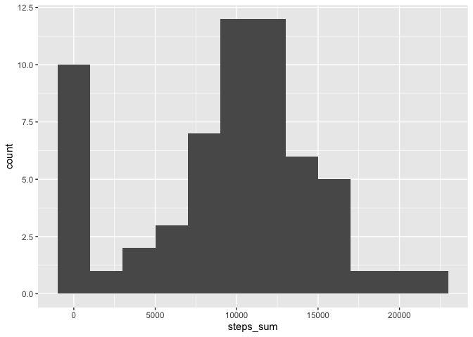
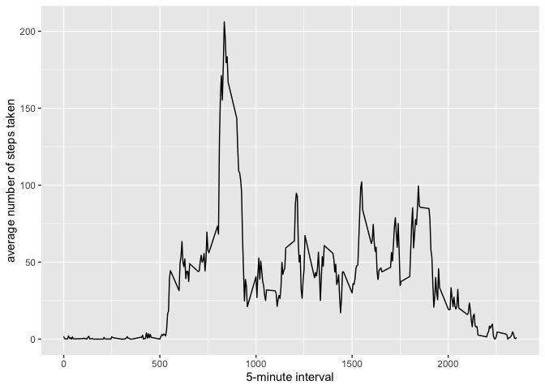
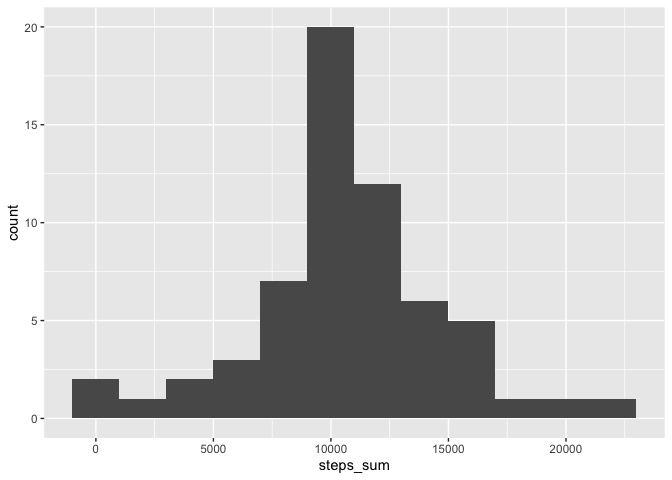
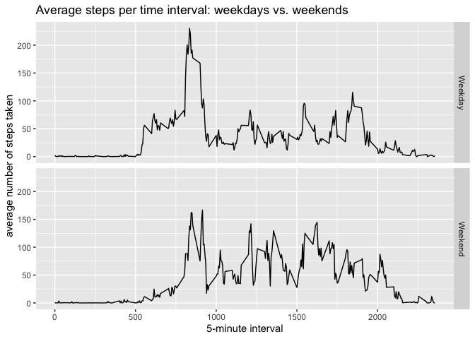

## Load tidyverse library


```r
library(tidyverse)
```

```
## ── Attaching packages ──────────────────────────────────────────────────────────────────────────────────────────── tidyverse 1.3.0 ──
```

```
## ✓ ggplot2 3.3.0     ✓ purrr   0.3.4
## ✓ tibble  3.0.1     ✓ dplyr   0.8.5
## ✓ tidyr   1.0.2     ✓ stringr 1.4.0
## ✓ readr   1.3.1     ✓ forcats 0.5.0
```

```
## ── Conflicts ─────────────────────────────────────────────────────────────────────────────────────────────── tidyverse_conflicts() ──
## x dplyr::filter() masks stats::filter()
## x dplyr::lag()    masks stats::lag()
```
        
## Loading and preprocessing the data


```r
destfile <- "Activity.zip"
# Unzip the data
if (!file.exists("activity.csv")) { 
        unzip(destfile) 
}

# read in the data
data <- read.csv("activity.csv")
head(data)
```

```
##   steps       date interval
## 1    NA 2012-10-01        0
## 2    NA 2012-10-01        5
## 3    NA 2012-10-01       10
## 4    NA 2012-10-01       15
## 5    NA 2012-10-01       20
## 6    NA 2012-10-01       25
```

```r
# transform the data into tibble
data <- data %>% as_tibble()

# convert the data variable into date class
data$date <- as.Date(data$date, format = "%Y-%m-%d")
```


## What is mean total number of steps taken per day?
1. Calculate the total number of steps taken per day

```r
# Assign the summary data to the variable step_sum.tb
# NOTE: the NA values are ignored as required so that the sum of a date, where all the data is NA, could be zero
step_sum.tb <- data %>% group_by(date) %>% summarise(steps_sum=sum(steps, na.rm = TRUE))
step_sum.tb
```

```
## # A tibble: 61 x 2
##    date       steps_sum
##    <date>         <int>
##  1 2012-10-01         0
##  2 2012-10-02       126
##  3 2012-10-03     11352
##  4 2012-10-04     12116
##  5 2012-10-05     13294
##  6 2012-10-06     15420
##  7 2012-10-07     11015
##  8 2012-10-08         0
##  9 2012-10-09     12811
## 10 2012-10-10      9900
## # … with 51 more rows
```

2. Make a histogram of the total number of steps taken each day

```r
# plot a histogram using ggplot2
step_sum.tb %>% ggplot(aes(x=steps_sum)) +
                        geom_histogram(binwidth = 2000)
```

<!-- -->

3. Calculate and report the mean and median of the total number of steps taken per day

```r
stepsByDayMean <- step_sum.tb$steps_sum %>% mean()
stepsByDayMean
```

```
## [1] 9354.23
```

```r
stepsByDayMedian <- step_sum.tb$steps_sum %>% median()
stepsByDayMedian
```

```
## [1] 10395
```
The mean of the total number of steps taken per day is 9354.2295082.
The median of the total number of steps taken per day is 10395.

## What is the average daily activity pattern?

1. Make a time series plot (i.e. type = "l") of the 5-minute interval (x-axis) and the average number of steps taken, averaged across all days (y-axis)

```r
# calculate the average number of steps taken, averaged across all days
stepsMean_perInterval <- data %>% 
        group_by(interval) %>% 
        summarise(stepsMean = mean(steps, na.rm = TRUE))

# plot a time series graph
stepsMean_perInterval %>% ggplot(aes(x = interval, y = stepsMean)) +
        geom_line() +
        xlab("5-minute interval") +
        ylab("average number of steps taken") +
        NULL
```

<!-- -->

2. Which 5-minute interval, on average across all the days in the dataset, contains the maximum number of steps?


```r
# which row contains the maximum number of steps
row_max <- stepsMean_perInterval$stepsMean %>% which.max()
# which 5-minute interval
interval_max <- stepsMean_perInterval$interval[row_max]
interval_max
```

```
## [1] 835
```

The 5-minute interval 835 contains the maximum number of steps.

## Imputing missing values

1. Calculate and report the total number of missing values in the dataset (i.e. the total number of rows with NAs)


```r
NA_total <- data$steps %>% is.na() %>% sum()
```

The total number of missing values in the dataset is 2304.

2&3. Create a new dataset that is equal to the original dataset but with the missing data filled in.
Here, the means for that 5-minute are used.


```r
# assign a new variable for imputation
data_imputed <- data
# get the row number of missing values
row_NA <- data$steps %>% is.na() %>% which()
# use a for loop to fill in the data
for (i in seq_along(row_NA)) {
        # the [i]th row number in row_NA
        which_row <- row_NA[i]
        # subset this row to get the interval
        interval_value <- data_imputed$interval[which_row]
        # fill in with the mean for this interval
        data_imputed$steps[which_row] <- stepsMean_perInterval$stepsMean[stepsMean_perInterval$interval == interval_value]
}

# check the data
head(data_imputed)
```

```
## # A tibble: 6 x 3
##    steps date       interval
##    <dbl> <date>        <int>
## 1 1.72   2012-10-01        0
## 2 0.340  2012-10-01        5
## 3 0.132  2012-10-01       10
## 4 0.151  2012-10-01       15
## 5 0.0755 2012-10-01       20
## 6 2.09   2012-10-01       25
```

4. Make a histogram of the total number of steps taken each day and Calculate and report the mean and median total number of steps taken per day. Do these values differ from the estimates from the first part of the assignment? What is the impact of imputing missing data on the estimates of the total daily number of steps?


```r
# calculate the total number of steps taken each day
data_imputed_sum <- data_imputed %>% 
        group_by(date) %>% 
        summarise(steps_sum=sum(steps)) 

# plot a histogram of the total number of steps taken each day
data_imputed_sum %>% 
        ggplot(aes(x=steps_sum)) +
                        geom_histogram(binwidth = 2000)
```

<!-- -->

```r
stepsByDayMeanFromImputed <- data_imputed_sum$steps_sum %>% mean()
stepsByDayMedianFromImputed <- data_imputed_sum$steps_sum %>% median()

# Do these values differ from the first part of the assignment?
stepsByDayMean == stepsByDayMeanFromImputed
```

```
## [1] FALSE
```

```r
stepsByDayMedian == stepsByDayMedianFromImputed
```

```
## [1] FALSE
```
The mean of the total number of steps taken per day is 1.0766189\times 10^{4}.
The median of the total number of steps taken per day is 1.0766189\times 10^{4}.
They are different from those from the first part of the assignment.


## Are there differences in activity patterns between weekdays and weekends?

```r
# assign the days of the week to the dates
data_imputed <- data_imputed %>% mutate(day_of_the_week = weekdays(date))
# weekday or weekend
data_imputed <- data_imputed %>% mutate(IsWeekend = day_of_the_week %in% c("Saturday", "Sunday"))
# label with weekdays or weekends accordingly
data_imputed$label <- NA
for (i in 1:nrow(data_imputed)) {
        if(data_imputed$IsWeekend[i]){
                data_imputed$label[i] <- "Weekend"
        }else{
                data_imputed$label[i] <- "Weekday"
        }
        
}
# calculate the average number of steps taken, averaged across all days
stepsMean_perInterval_filled <- data_imputed %>% 
        group_by(label,interval) %>% 
        summarise(stepsMean = mean(steps))

# plot a time series graph
stepsMean_perInterval_filled %>% ggplot(aes(x = interval, y = stepsMean)) +
        geom_line() +
        facet_grid(rows = vars(label)) +
        xlab("5-minute interval") +
        ylab("average number of steps taken") +
        ggtitle("Average steps per time interval: weekdays vs. weekends") +
        NULL
```

<!-- -->

The activity patterns between weekdays and weekends look different.


